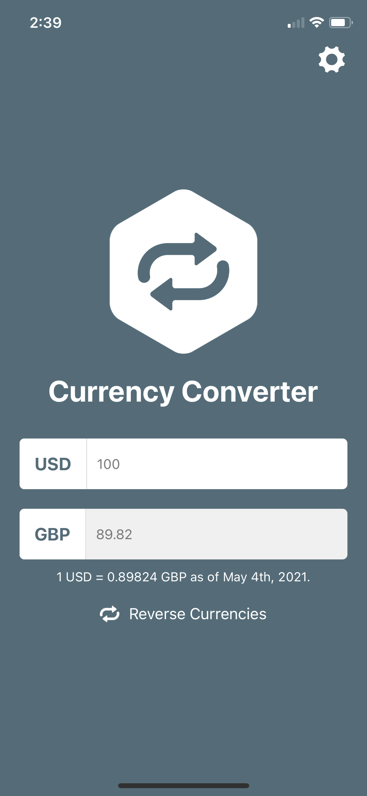
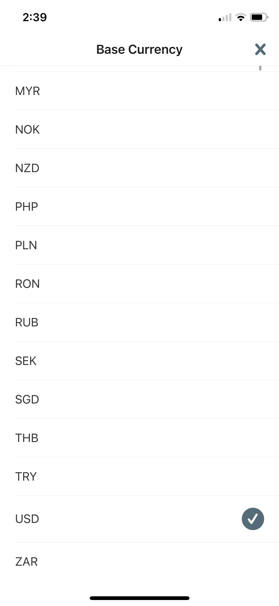

# Currency Converter - React Native Tutorial
This project was created following the tutorial from [React Native School](https://www.reactnativeschool.com/).

## Lessons Learned
* Setup with Expo, iOS Simulator, and Android Emulator
* React Native features such as scrollable screens, touchable components, navigation, and loading state
* Screen, window, and keyboard sizes

## Project Features
* Convert value between two currencies
* Swap currencies being compared
* Connect to a local API with sample currency conversion rates - not accurate information

## Screenshots

